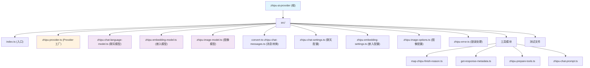

# Zhipu AI Provider - Vercel AI SDK Community Provider

> [根目录](./) > **CLAUDE.md**

## 变更记录 (Changelog)

| 日期 | 操作 | 描述 |
|------|------|------|
| 2025-12-30 17:38:19 | 初始化 | 首次生成 AI 上下文文档与索引 |

---

## 项目愿景

这是一个为 [Vercel AI SDK](https://sdk.vercel.ai/) 提供智谱 AI (Zhipu AI / bigmodel.cn) 服务集成的社区 Provider。它让开发者能够通过统一的 AI SDK 接口，无缝使用智谱的 GLM 系列大语言模型、文本嵌入模型和图像生成模型。

## 架构总览

### 技术栈
- **语言**: TypeScript 5.6
- **运行时**: Node.js >=18 (支持 Edge Runtime)
- **构建工具**: tsup
- **测试框架**: Vitest (Node + Edge 环境)
- **包管理**: pnpm
- **许可**: Apache-2.0

### 设计模式
- **Provider Pattern**: 实现 AI SDK v2 规范的 `ProviderV2` 接口
- **Factory Pattern**: `createZhipu()` 工厂函数创建可配置的 provider 实例
- **Stream Processing**: 使用 TransformStream 处理 SSE 流式响应

---

## 模块结构图



---

## 模块索引

| 模块路径 | 类型 | 职责 |
|---------|------|------|
| `src/` | 核心源码 | TypeScript 源代码目录 |
| `src/index.ts` | 入口 | 导出 createZhipu、zhipu 及相关类型 |
| `src/zhipu-provider.ts` | Provider | 创建 provider 实例，配置 baseURL、apiKey、headers |
| `src/zhipu-chat-language-model.ts` | 模型 | 实现聊天/视觉/推理模型，支持流式与非流式 |
| `src/zhipu-embedding-model.ts` | 模型 | 实现文本嵌入模型 |
| `src/zhipu-image-model.ts` | 模型 | 实现图像生成模型 |
| `src/convert-to-zhipu-chat-messages.ts` | 转换 | 将 AI SDK prompt 转换为 Zhipu API 消息格式 |
| `src/zhipu-chat-settings.ts` | 类型定义 | 聊天模型 ID 类型与配置选项 |
| `src/zhipu-embedding-settings.ts` | 类型定义 | 嵌入模型 ID 类型与配置选项 |
| `src/zhipu-image-options.ts` | 类型定义 | 图像模型 ID 类型与配置选项 |
| `src/zhipu-error.ts` | 错误处理 | Zhipu API 错误响应解析 |
| `src/zhipu-chat-prompt.ts` | 类型定义 | Zhipu 消息格式类型定义 |
| `src/map-zhipu-finish-reason.ts` | 工具 | 将 Zhipu finish_reason 映射到 AI SDK 标准值 |
| `src/get-response-metadata.ts` | 工具 | 提取响应元数据 (id, modelId, timestamp) |
| `src/zhipu-prepare-tools.ts` | 工具 | 准备工具调用参数 (已弃用/未使用) |

---

## 运行与开发

### 环境变量
```bash
ZHIPU_API_KEY=<your-api-key>  # 从 bigmodel.cn 获取
```

### 安装依赖
```bash
pnpm install
```

### 可用脚本
| 命令 | 描述 |
|------|------|
| `pnpm build` | 使用 tsup 构建 CommonJS & ESM 输出 |
| `pnpm build:watch` | 监听模式构建 |
| `pnpm clean` | 清理 dist 目录 |
| `pnpm lint` | 使用 ESLint 检查代码 |
| `pnpm type-check` | TypeScript 类型检查 |
| `pnpm prettier-check` | Prettier 格式检查 |
| `pnpm test` | 运行所有测试 (Node + Edge) |
| `pnpm test:node` | 运行 Node 环境测试 |
| `pnpm test:edge` | 运行 Edge Runtime 环境测试 |

### 构建产物
- `dist/index.js` - CommonJS 格式
- `dist/index.mjs` - ES Module 格式
- `dist/index.d.ts` - TypeScript 类型声明

---

## 测试策略

### 测试环境
- **Vitest** 作为测试运行器
- 双环境测试：Node.js + Edge Runtime
- 测试文件命名：`*.test.ts`

### 测试覆盖范围
- `zhipu-chat-language-model.test.ts` - 聊天模型核心功能测试
- `zhipu-embedding-model.test.ts` - 嵌入模型测试
- `convert-to-zhipu-chat-messages.test.ts` - 消息转换测试

### 测试辅助工具
- 使用 `@ai-sdk/provider-utils/test` 中的 `createTestServer` 模拟 API 响应
- 使用 `convertReadableStreamToArray` 验证流式响应

---

## 编码规范

### TypeScript 配置
- **Target**: ES2018
- **Module**: ESNext
- **Module Resolution**: Bundler
- **Strict Mode**: 启用
- **类型声明**: 生成 `.d.ts` 和 `.d.ts.map`

### ESLint 配置
- 基于 `@eslint/js` 的推荐配置
- 使用 `typescript-eslint` 的推荐配置

### 代码风格
- 无特殊 Prettier 配置，使用默认设置
- 使用 Zod 进行运行时 schema 验证
- 遵循 AI SDK v2 规范接口

---

## AI 使用指引

### 核心概念

#### Provider 实例
```typescript
import { createZhipu, zhipu } from 'zhipu-ai-provider'

// 使用默认实例（自动读取 ZHIPU_API_KEY 环境变量）
const model = zhipu('glm-4-plus')

// 或创建自定义实例
const customProvider = createZhipu({
  baseURL: 'https://open.bigmodel.cn/api/paas/v4',
  apiKey: 'your-api-key',
  headers: { 'Custom-Header': 'value' }
})
```

#### 支持的模型类型
- **GLM-4.7 系列**（最新旗舰）: `glm-4.7` (200K上下文)
- **GLM-4.6 系列**（超强性能）: `glm-4.6` (200K上下文)
- **GLM-4.5 系列**（性能优秀）: `glm-4.5`, `glm-4.5-x`, `glm-4.5-air`, `glm-4.5-airx`, `glm-4.5-flash` (免费)
- **GLM-4.6V 系列**（视觉推理）: `glm-4.6v`, `glm-4.6v-flash` (免费)
- **GLM-4.5V**（视觉推理）: `glm-4.5v`
- **传统模型**: `glm-4-plus`, `glm-4-air`, `glm-4-flash`, `glm-4-long`, `glm-4v`, `glm-z1-*`
- **嵌入模型**: `embedding-2`, `embedding-3` (支持 dimensions: 256/512/1024/2048)
- **图像模型**: `cogview-3-flash`, `cogview-4`, `cogview-4-250304`

#### API 调用模式
```typescript
// 文本生成
import { generateText } from 'ai'
const { text } = await generateText({
  model: zhipu('glm-4-plus'),
  prompt: 'Why is the sky blue?'
})

// 文本嵌入
import { embed } from 'ai'
const { embedding } = await embed({
  model: zhipu.textEmbeddingModel('embedding-3', { dimensions: 256 }),
  value: 'Hello, world!'
})

// 图像生成
import { experimental_generateImage as generateImage } from 'ai'
const { providerMetadata } = await generateImage({
  model: zhipu.ImageModel('cogview-4-250304'),
  prompt: 'A beautiful landscape',
  providerOptions: {
    zhipu: { quality: 'hd' }
  }
})
// 图像 URL 在 providerMetadata.zhipu.images[0].url
```

### 实现细节

#### 消息转换 (`convert-to-zhipu-chat-messages.ts`)
- 将 AI SDK 的 `LanguageModelV2Prompt` 转换为 Zhipu API 消息格式
- 支持文本、图像 (base64/URL)、视频 (URL)、工具调用
- 处理 system、user、assistant、tool 角色

#### 流式处理 (`zhipu-chat-language-model.ts`)
- 使用 TransformStream 处理 SSE (Server-Sent Events) 响应
- 支持 reasoning_content（推理内容）和普通 content（文本内容）
- 分块处理工具调用参数累积

#### 错误处理 (`zhipu-error.ts`)
- 统一的错误响应解析器
- Zod schema 验证错误格式

#### Thinking 模式（GLM-4.5/4.6/4.7 系列专用）

GLM-4.5、GLM-4.6 和 GLM-4.7 系列支持深度思考模式，通过 `thinking` 参数控制：

```typescript
const model = zhipu('glm-4.7', {
  thinking: { type: 'enabled' }
})
```

- **enabled**: 动态思考模式，根据任务复杂度自动调整（默认）
- **disabled**: 禁用思考，直接响应

API 请求格式：
```json
{
  "model": "glm-4.7",
  "messages": [...],
  "thinking": { "type": "enabled" }
}
```

响应格式：
```json
{
  "choices": [{
    "message": {
      "content": "最终回答",
      "reasoning_content": "思考过程（仅推理模型）"
    }
  }]
}
```

### 限制与已知问题

#### 不支持的设置
- `topK`, `frequencyPenalty`, `presencePenalty` - 聊天模型不支持
- `stopSequences` - 视觉模型和单个 stop sequence 以外的情况
- `seed` - 不支持
- `n` (图像数量) - 图像模型仅支持单张

#### 特殊处理
- **推理模型**: 模型 ID 包含 `z` 或 `thinking` 时自动识别为推理模型
- **视觉模型**: 模型 ID 包含 `v` 时自动识别为视觉/视频模型
- **JSON 响应格式**: 仅支持 `{ type: 'json' }`，不支持 schema (vision/reasoning 模型)

---

## 发布流程

### GitHub Actions 自动发布
- 触发条件：创建 GitHub Release 时
- 流程：安装依赖 -> 构建 -> 发布到 NPM
- 访问权限：需要 `NPM_TOKEN` secret

### 手动发布
```bash
pnpm build
pnpm publish --access public
```

---

## 外部资源

- [Zhipu AI 文档](https://bigmodel.cn/dev/welcome)
- [Vercel AI SDK 文档](https://sdk.vercel.ai/docs/introduction)
- [GitHub 仓库](https://github.com/Xiang-CH/zhipu-ai-provider)
- [NPM 包](https://www.npmjs.com/package/zhipu-ai-provider)

---

## 覆盖率报告

| 指标 | 值 |
|------|-----|
| 总文件数 | ~40 (含 .git 目录) |
| 源文件数 | 16 TypeScript 文件 |
| 配置文件 | 8 个 (tsconfig, eslint, vitest, tsup, turbo 等) |
| 测试文件 | 3 个 |
| 扫描覆盖率 | 100% (核心模块) |

### 已扫描模块
- [x] src/ 目录所有源文件
- [x] 测试配置与入口文件
- [x] 构建配置 (tsup, TypeScript)
- [x] CI/CD 配置 (GitHub Actions)
- [x] 文档文件 (README, CHANGELOG, LICENSE)

### 缺口与建议
- 无明显缺口，项目结构清晰且规模较小
- 可考虑添加：
  - 更多集成测试示例
  - 性能基准测试
  - Migration 指南 (从 v4 到 v5)

---

## 依赖关系

### 核心依赖
- `@ai-sdk/provider` (2.0.0-beta.1) - AI SDK provider 接口定义
- `@ai-sdk/provider-utils` (3.0.0-beta.5) - 工具函数 (fetch, headers, stream 等)

### 开发依赖
- `ai` (5.0.0-beta.25) - Vercel AI SDK 主包（用于开发测试）
- `zod` (4.0.5) - Schema 验证
- `vitest` - 测试框架
- `@edge-runtime/vm` - Edge Runtime 环境
- `typescript-eslint` - TypeScript ESLint
- `tsup` - 构建工具

---

## 常见问题 (FAQ)

### Q: 图像生成如何获取图片？
A: Zhipu 图像 API 不直接返回 base64 或 buffer，而是返回 URL。图像 URL 存储在返回结果的 `providerMetadata.zhipu.images[0].url` 中。

### Q: 如何使用推理模型？
A: 直接使用包含 `z` 或 `thinking` 的模型 ID（如 `glm-z1-air`, `glm-4.1v-thinking-flash`），provider 会自动识别并处理 reasoning_content 字段。

### Q: Edge Runtime 支持吗？
A: 是的，项目支持 Edge Runtime，使用 `@edge-runtime/vm` 进行测试。

### Q: 如何自定义请求头？
A: 在 `createZhipu()` 时传入 `headers` 参数，或在每次调用时传入 `headers` 选项。

---

**生成时间**: 2025-12-30 17:38:19
**版本**: 0.2.0-beta.1
